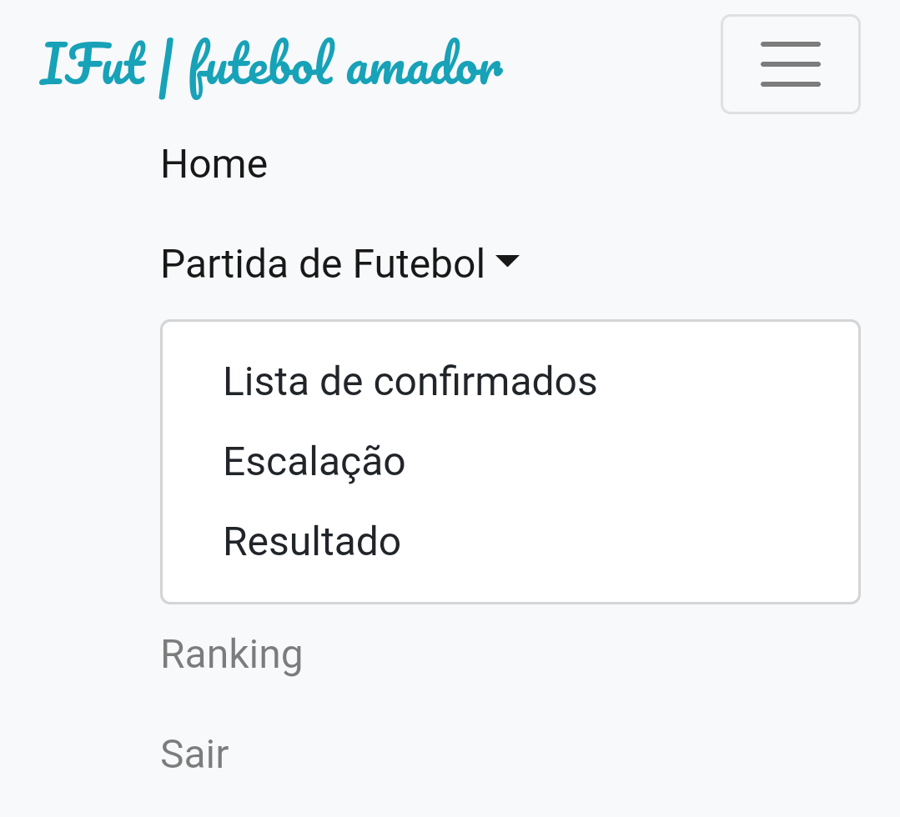
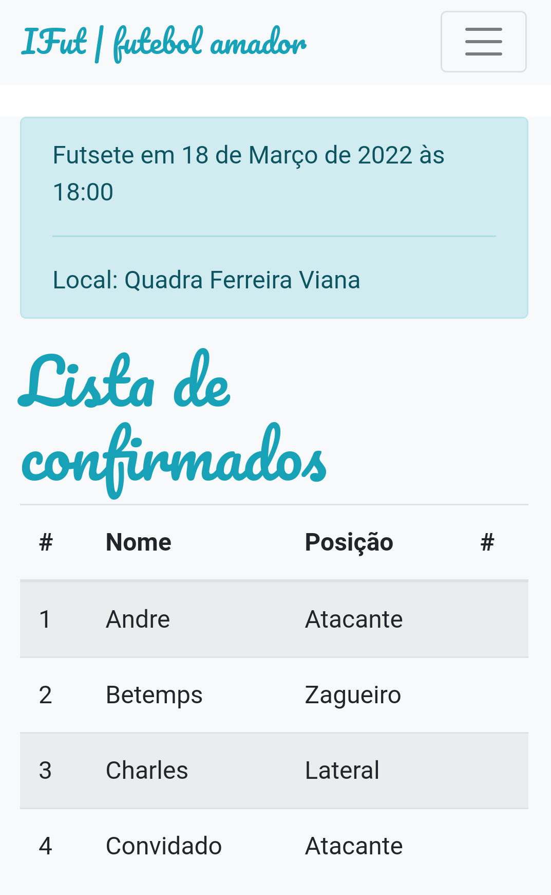
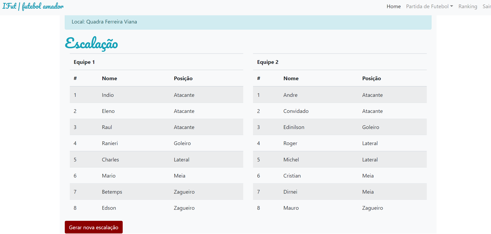

# Sistema para controlar partidas do futebol de um grupo de amigos.

Projeto de um sistema que criei para compartilhar com a turma de amigos que gostam de um futebol, churrasco e cerveja.
A aplicação tem uma interface de administração onde é possível cadastrar os atletas, suas posições em campo, a data e local do jogo. Os atletas podem acessar o sistema e 
confirmar presença para os jogos. Além disso, é possível escalar as duas equipes conforme a posição de cada atleta. O sistema ainda mantem uma pontuação para cada atleta.
Esta pontuação é gerada conforme o resultado da partida. Três pontos para cada atleta da equipe vencedora e em caso de empate, 1 ponto para todos.

Acesse o link: [https://futebolamador.herokuapp.com](https://futebolamador.herokuapp.com)
### Barra de navegação

### Lista de confirmados

### Escalação das equipes

